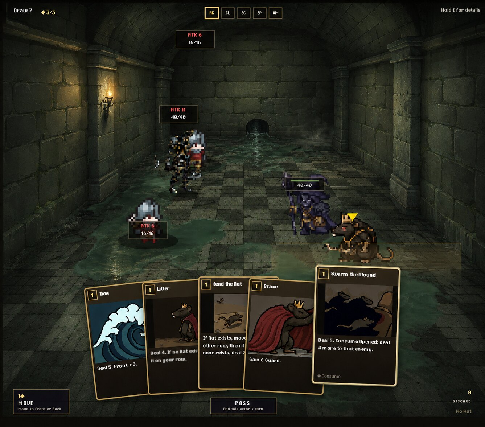

# F1 flooded arena reference

This is the approved visual target for the first combat battlefield backdrop.
It is a composition and art-direction reference, not literal production UI
art: preserve the game's real HUD, card text, actors, and interaction states.

## Target qualities

- Late-1990s high-color pre-rendered RPG atmosphere.
- Broad, readable masonry masses with restrained wall microtexture.
- Vaulted ceiling, modest far-wall drain, and believable architectural depth.
- Existing green-gray floor identity with deliberate puddles and reflections.
- Warm torchlight balanced by cold reflected water light.
- Clear central play space and strong sprite readability.

## Explicitly avoid

- Giant focal gates or grilles.
- Aggressive SNES-style downscaling or hard palette crushing.
- Procedural sludge carpets, noisy brick seams, or photorealistic PBR.
- Replacing the production UI with generated text.
