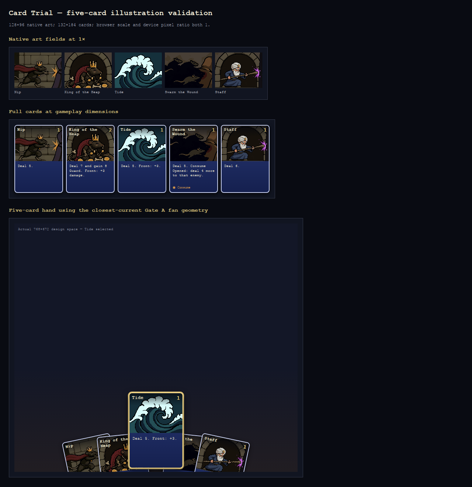

# Card Trial five-card art validation — 2026-08-22

## Scope and checkpoint

The battlefield Front/Back work is frozen separately at `28e16c0`
(`feat: present Card Trial front/back spatially`). This art branch is based on
that checkpoint and does not change row mechanics, choreography, targeting,
enemy rows, HUD layout, card balance, or hand physics.

This pass stops at the requested five-card validation batch. It creates
illustration fields and editable sources, not complete cards and not the rest
of the deck.

## Authoritative mechanics

The production brief was checked against `src/game/card-trial/cards.ts` before
generation:

| Card | Cost | Hero | Exact rules text |
| --- | ---: | --- | --- |
| Nip | 1 | Rat King | Deal 5. |
| King of the Heap | 2 | Rat King | Deal 7 and gain 8 Guard. Front: +3 damage. |
| Tide | 1 | Rat King | Deal 5. Front: +3. |
| Swarm the Wound | 1 | Rat King | Deal 5. Consume Opened: deal 4 more to that enemy. |
| Staff | 1 | Old Man | Deal 6. |

No generated concept was allowed to introduce mechanics, card chrome, text,
costs, keywords, or resources.

## Reference hierarchy and working density

- Rat King identity: `art/card-trial/references/rat-king-identity.png`, taken
  from the canonical local Rat King idle sequence. It supplies anatomy,
  crown, cloak, tail, and armorless costume—not card-rendering density.
- Old Man identity: `art/card-trial/references/old-man-identity.png`, taken from
  the runtime Priest idle strip. It supplies the wrapped head, beard, blue robe,
  gold wrap patch, staff, and posture.
- King of the Heap composition: `art/card-trial/references/king-of-the-heap-composition.png`.
  The locally available prior mockup was substantially denser than the binding
  target, so it was used for broad composition only and rejected as a style or
  pixel-density source. No locally identifiable copy of the approved low-detail
  master was available for direct adaptation.

King of the Heap was therefore recreated at a native 128×96 px. Its selected,
cleaned production PNG became the style reference for the other four cards.
Every final illustration remains 128×96, fully opaque, and is displayed at
native scale in the review fixture. This fits exactly inside the closest-current
132×184 physical-card width after its 2 px border.

## Generation and cleanup ledger

| Card | PixelLab production | Aseprite production cleanup | Final |
| --- | --- | --- | --- |
| King of the Heap | Pro job `6a94efc3-8248-4792-bafa-f7933dcab858`, four candidates; candidate 3 selected for density/silhouette. Controlled edit `2d842e5e-6039-4b2b-a499-65f9037b9344` restored a readable short scepter and broad heap/rat/treasure cues without adding armor or detail. | Added `Pixel cleanup` layer, reinforced the staff cluster, and normalized generated near-black variants. | 44 colors; `public/assets/card-trial/cards/king-of-the-heap.png`; source `art/card-trial/cards/king-of-the-heap.aseprite`. |
| Nip | Pro job `8b089fb7-2087-4054-aaeb-8e51ecffc931`, four candidates; candidate 0 selected. Controlled edit `ed8684cd-795a-45a0-8d58-47600889cfe7` clarified the cropped hooded foe and plain-cloth torso. | Removed one isolated bright hood pixel and normalized near-black variants. | 37 colors; `public/assets/card-trial/cards/nip.png`; source `art/card-trial/cards/nip.aseprite`. |
| Tide | Pro job `9180461b-41d1-4dd3-9247-370dbd5a56c4`, four candidates; candidate 3 selected directly. | Removed two isolated anti-alias edge pixels and unified near-black outline variants. | 12 colors; `public/assets/card-trial/cards/tide.png`; source `art/card-trial/cards/tide.aseprite`. |
| Swarm the Wound | Pro job `57d8e437-8c28-4509-8399-5ec415f23685`, four candidates; candidate 2 selected directly. | Hardened three anti-aliased swarm-edge pixels and unified the deep shadow mass. | 20 colors; `public/assets/card-trial/cards/swarm-the-wound.png`; source `art/card-trial/cards/swarm-the-wound.aseprite`. |
| Staff | Pro job `563bd1d7-074d-48d8-9f75-594d79d4a276`, four candidates; candidate 0 selected directly. | Restored the canonical muted-gold wrap patch, preserved the beard/robe/staff silhouette, and normalized near-black variants. | 41 colors; `public/assets/card-trial/cards/staff.png`; source `art/card-trial/cards/staff.aseprite`. |

PixelLab MCP tools actually used: balance lookup, Pro generation, per-candidate
retrieval, and text-guided image editing. The batch consumed 140 subscription
generations (586 before, 446 after).

Aseprite MCP tools actually used: canvas creation for workspace setup, layer
creation, pixel drawing, and PNG export. Because the MCP exposes no import/open
operation, the local Aseprite 1.3.18 CLI imported the selected PixelLab PNGs
into `.aseprite` files; all production files then received MCP pixel edits and
MCP final exports. `scripts/art/aseprite-normalize-near-black.lua` performs the
reproducible removal of PixelLab's nearly-black color noise without touching
visible midtones.

## Five-card review

The final family uses different recognition silhouettes rather than one
repeated portrait template:

- Nip: low left-to-right thrust.
- King of the Heap: large seated royal silhouette.
- Tide: one huge graphic wave.
- Swarm the Wound: one dark rat mass consuming the target.
- Staff: wrapped-head Old Man and one lateral staff strike.

Rat King remains dark-furred, crowned, red-cloaked, lean, tailed, and armorless.
Old Man retains the runtime wrapped head, beard, blue robe, gold patch, and
plain staff. Only King of the Heap and Staff use a dungeon arch; their seated
icon and lateral strike are otherwise distinct. There are no glowing orbs,
particle clouds, orange/teal lighting, painterly gradients, or card UI baked
into the assets.

`scripts/playtests/card-trial-card-art-verify.mjs` loads the production build
and captures all five illustrations at 1×, five complete 132×184 cards, and a
768×672 five-card fan using the closest-current Gate A geometry. It asserts
five 128×96 natural and rendered image sizes. The run completed with
`page errors []`; local evidence remains under
`playtest-screenshots/card-trial-card-art/`.

The final `npm run check` passed: app/test/tools TypeScript, production Vite
build, 141 test files / 2,579 tests, floor validation (with the pre-existing
Floor 1 warnings), and floor export consistency. The standard develop-web-game
browser client also rendered the production title screen cleanly from this
build.

## Disposition

Recommendation: **GO** for a later remainder-of-deck pass. Stop here for owner
review as requested; no additional cards were generated and no runtime card or
hand implementation was changed.
