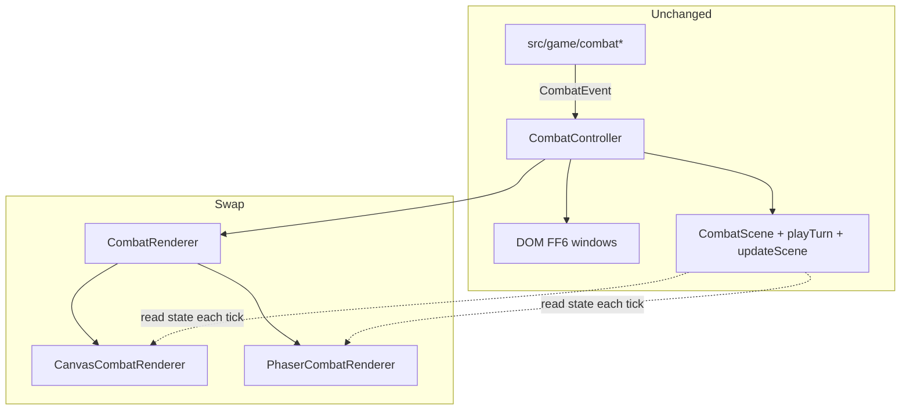

# Phaser Combat Renderer Implementation Plan

> **Design source of truth:** [`docs/superpowers/specs/2026-07-29-phaser-combat-port-design.md`](../specs/2026-07-29-phaser-combat-port-design.md) — when this plan conflicts (e.g. interface naming `CombatStage`, Phaser.AUTO, sibling canvas, Phase 0→5), follow the design.

> **For agentic workers:** REQUIRED SUB-SKILL: Use superpowers:subagent-driven-development (recommended) or superpowers:executing-plans to implement this plan task-by-task. Steps use checkbox (`- [ ]`) syntax for tracking.

**Goal:** Swap only the combat **draw** backend to Phaser 4 while keeping the existing `CombatScene` choreography engine, `CombatController` turn loop, DOM FF6 menus, and all `src/game/` combat rules.

**Architecture:** Verified finding — `combat-scene.ts` has **zero** `CanvasRenderingContext2D` / `ctx` usage before line 3117 (`// --- Drawing ---`). Choreography (`playTurn` / `updateScene` / popups-as-data) stays; introduce a `CombatRenderer` interface with a canvas adapter (today’s `renderScene`) and a Phaser adapter that syncs GameObjects from the same `CombatScene` each tick. Do **not** reimplement event→timeline logic in Phaser.

**Tech Stack:** TypeScript, Vite 8, **Phaser 4.2.1** (pin exact; not 3.x), Vitest, existing strip assets under `public/assets/{enemies,party,effects}/`. Phaser 4 import style: `import * as Phaser from "phaser"` (default import is broken in v4). Use **`Phaser.AUTO`** (WebGL when available; Canvas renderer still exists in 4.2.1 as fallback — do **not** require WebGL-only or a bespoke no-WebGL path).

**Design (authoritative):** [`docs/superpowers/specs/2026-07-29-phaser-combat-port-design.md`](../specs/2026-07-29-phaser-combat-port-design.md)  
**Earlier shorter draft:** superseded and no longer retained.
**Prompt:** the one-off planning prompt is no longer retained; use the design source above.

## Global Constraints

- **No game-logic changes** in `src/game/` (damage, initiative, perks, events, saves).
- **Do not rewrite `playTurn`** as Phaser timelines — choreography is the source of truth.
- DOM combat menus (`combat-select-action-view.ts`) stay for Scopes A–B; Scope C is out of this plan.
- Corridor / town / camp / title stay on the current stack.
- Boss internal ids stay (`headmasters-echo` / `-remnant` / `-ascendant`); display names The Dead Boy / The Lonely Girl / The Crying Man.
- Preserve `CombatController.isChoreographyDone()` / `debugView()` semantics for `__onyxDebug.isIdle()` / `snapshot()`.
- `shell.showMode()` remains the only major mode visibility toggle.
- Phaser must not steal keyboard (`input.keyboard` disabled) so DOM menus keep working.
- `npm run build` and `npm test` must pass at end of every task that touches `src/`.
- **Do not commit** unless the user explicitly asks; commit steps below are optional checkpoints.
- Default renderer remains **canvas** until Scope B parity checklist is green; then switch default to Phaser behind the same flag.

## File map

| File | Responsibility |
|------|----------------|
| Modify `src/engine/combat-scene.ts` | Keep choreography only after split; re-export draw symbols temporarily if needed |
| Create `src/engine/combat-canvas-draw.ts` | Move all `draw*` + `renderScene` + `drawFF6Window` here |
| Create `src/engine/combat-renderer.ts` | `CombatRenderer` interface + `createCombatRenderer(kind)` + flag resolution |
| Create `src/engine/combat-canvas-renderer.ts` | `CanvasCombatRenderer` wrapping `renderScene` + `combatCanvas` |
| Create `src/engine/combat-phaser-renderer.ts` | Phaser.Game lifecycle + sync-from-`CombatScene` |
| Create `src/engine/combat-phaser-scene.ts` | Phaser.Scene subclass: layers, sprite pools, overlay objects |
| Create `src/engine/combat-renderer-flag.ts` | `?combatRenderer=` / localStorage / debug setter |
| Modify `src/engine/combat-ui.ts` | Construct/destroy renderer; `tick()` calls `renderer.render` instead of raw `renderScene` |
| Modify `src/engine/shell.ts` | Optional `#combat-phaser-host` sibling; resize hook |
| Modify `src/styles.css` | Host sizing so Phaser canvas matches `#combat-canvas` box |
| Modify `src/main.ts` | Expose `__onyxDebug.setCombatRenderer` when `?debug=1` |
| Modify `package.json` | Add `phaser` dependency |
| Create `src/engine/combat-renderer-flag.test.ts` | Flag parsing tests |
| Create `src/engine/combat-canvas-draw.test.ts` | Re-home any draw-only exports tests if split breaks imports |
| Keep `src/engine/combat-scene.test.ts` | Must stay green — imports choreography only (already does) |



---

### Task 1: Split draw code out of `combat-scene.ts`

**Files:**
- Create: `src/engine/combat-canvas-draw.ts`
- Modify: `src/engine/combat-scene.ts` (delete Drawing section; export any helpers draw needs)
- Modify: `src/vfx-vignette.ts` (import `renderScene` from new module)
- Modify: `src/engine/combat-ui.ts` (import `renderScene` from new module — temporary until Task 2)
- Test: `npx vitest run src/engine/combat-scene.test.ts src/engine/effect-sprite-wiring.test.ts`

**Interfaces:**
- Consumes: `CombatScene`, `partyPos`, `enemyPos`, `allyPos`, anim helpers, strip caches, `COLORS`/`PARTY_SIZE`/`ENEMY_SIZE`/`BOSS_SIZE` (export sizes from choreography module or a tiny `combat-scene-constants.ts` if draw cannot see private consts)
- Produces:
  ```ts
  export function renderScene(
    ctx: CanvasRenderingContext2D,
    w: number,
    h: number,
    scene: CombatScene,
    now: number
  ): void;
  export function drawFF6Window(
    ctx: CanvasRenderingContext2D,
    x: number,
    y: number,
    w: number,
    h: number
  ): void;
  ```

**Why first:** Proves the canvas-free choreography boundary in git history and makes Phaser a peer of canvas draw, not a rewrite of `playTurn`.

- [ ] **Step 1: Confirm the split line**

```bash
# Expect: no matches in the choreography half
rg -n '\bctx\b|CanvasRenderingContext2D' src/engine/combat-scene.ts | head -5
# First hit should be at/after the Drawing banner (~3117)
```

- [ ] **Step 2: Move Drawing section verbatim**

Cut from `// --- Drawing ---` through end of `renderScene` (and any draw-only helpers after it) into `combat-canvas-draw.ts`. Add imports for types/`CombatScene`/pos helpers/strip getters/`getEffectSprite`/constants.

If `COLORS`, `PARTY_SIZE`, `ENEMY_SIZE`, `BOSS_SIZE`, `getCombatBg`, tint filters, or `enemyStripState` are only used by draw, move them with the draw file. If choreography also uses a constant, **export** it from `combat-scene.ts` and import in draw.

Export anything draw currently uses that is file-private today (e.g. `animOffset` if draw reads it — check; prefer exporting a small `getActorDrawPose(scene, kind, id, now, w, h)` later rather than exporting every private).

- [ ] **Step 3: Fix importers**

- `combat-ui.ts`: `renderScene` from `./combat-canvas-draw`
- `vfx-vignette.ts`: same
- Keep choreography exports on `./combat-scene` so `combat-scene.test.ts` needs **no** import path changes

- [ ] **Step 4: Verify**

```bash
npx vitest run src/engine/combat-scene.test.ts src/engine/effect-sprite-wiring.test.ts
npm run build
```

Expected: all pass; `combat-scene.ts` has no `CanvasRenderingContext2D`.

- [ ] **Step 5: Optional commit** (only if user asks)

```bash
git add src/engine/combat-scene.ts src/engine/combat-canvas-draw.ts src/engine/combat-ui.ts src/vfx-vignette.ts
git commit -m "$(cat <<'EOF'
refactor(combat): split canvas draw from choreography engine

EOF
)"
```

---

### Task 2: `CombatRenderer` interface + canvas adapter + flag

**Files:**
- Create: `src/engine/combat-renderer.ts`
- Create: `src/engine/combat-canvas-renderer.ts`
- Create: `src/engine/combat-renderer-flag.ts`
- Create: `src/engine/combat-renderer-flag.test.ts`
- Modify: `src/engine/combat-ui.ts`
- Modify: `src/main.ts` (debug setter)

**Interfaces:**
- Produces:
  ```ts
  // combat-renderer.ts
  import type { CombatScene } from "./combat-scene";

  export type CombatRendererKind = "canvas" | "phaser";

  export interface CombatRenderer {
    readonly kind: CombatRendererKind;
    render(scene: CombatScene, w: number, h: number, now: number): void;
    destroy(): void;
  }

  export function createCombatRenderer(kind: CombatRendererKind): CombatRenderer;
  // phaser branch may throw or lazy-load — Task 3 implements it

  // combat-renderer-flag.ts
  export function resolveCombatRendererKind(
    search?: string,
    storage?: Storage | null
  ): CombatRendererKind;
  export function setCombatRendererKind(kind: CombatRendererKind): void;
  ```

- [ ] **Step 1: Failing tests for flag resolution**

```ts
// src/engine/combat-renderer-flag.test.ts
import { describe, it, expect, beforeEach } from "vitest";
import {
  resolveCombatRendererKind,
  setCombatRendererKind,
} from "./combat-renderer-flag";

describe("resolveCombatRendererKind", () => {
  beforeEach(() => {
    localStorage.removeItem("onyx.combatRenderer");
  });

  it("defaults to canvas", () => {
    expect(resolveCombatRendererKind("", localStorage)).toBe("canvas");
  });

  it("honors ?combatRenderer=phaser", () => {
    expect(
      resolveCombatRendererKind("?combatRenderer=phaser", localStorage)
    ).toBe("phaser");
  });

  it("honors localStorage when query absent", () => {
    localStorage.setItem("onyx.combatRenderer", "phaser");
    expect(resolveCombatRendererKind("", localStorage)).toBe("phaser");
  });

  it("query overrides storage", () => {
    localStorage.setItem("onyx.combatRenderer", "phaser");
    expect(
      resolveCombatRendererKind("?combatRenderer=canvas", localStorage)
    ).toBe("canvas");
  });
});
```

- [ ] **Step 2: Run — expect FAIL (module missing)**

```bash
npx vitest run src/engine/combat-renderer-flag.test.ts
```

- [ ] **Step 3: Implement flag + canvas renderer**

```ts
// combat-renderer-flag.ts
const KEY = "onyx.combatRenderer";

export type CombatRendererKind = "canvas" | "phaser";

export function resolveCombatRendererKind(
  search = typeof location !== "undefined" ? location.search : "",
  storage: Storage | null = typeof localStorage !== "undefined" ? localStorage : null
): CombatRendererKind {
  const q = new URLSearchParams(search.startsWith("?") ? search.slice(1) : search);
  const fromQuery = q.get("combatRenderer");
  if (fromQuery === "phaser" || fromQuery === "canvas") return fromQuery;
  const fromStore = storage?.getItem(KEY);
  if (fromStore === "phaser" || fromStore === "canvas") return fromStore;
  return "canvas";
}

export function setCombatRendererKind(kind: CombatRendererKind): void {
  localStorage.setItem(KEY, kind);
}
```

```ts
// combat-canvas-renderer.ts
import { combatCanvas } from "./shell";
import { renderScene } from "./combat-canvas-draw";
import type { CombatRenderer } from "./combat-renderer";
import type { CombatScene } from "./combat-scene";

export function createCanvasCombatRenderer(): CombatRenderer {
  return {
    kind: "canvas",
    render(scene, w, h, now) {
      const ctx = combatCanvas.getContext("2d");
      if (!ctx) return;
      // Keep canvas visible when this backend is active
      combatCanvas.style.display = "";
      renderScene(ctx, w, h, scene, now);
    },
    destroy() {
      /* canvas is owned by shell — no teardown */
    },
  };
}
```

```ts
// combat-renderer.ts
import { resolveCombatRendererKind, type CombatRendererKind } from "./combat-renderer-flag";
import { createCanvasCombatRenderer } from "./combat-canvas-renderer";
import type { CombatScene } from "./combat-scene";

export type { CombatRendererKind };
export interface CombatRenderer {
  readonly kind: CombatRendererKind;
  render(scene: CombatScene, w: number, h: number, now: number): void;
  destroy(): void;
}

export function createCombatRenderer(kind?: CombatRendererKind): CombatRenderer {
  const k = kind ?? resolveCombatRendererKind();
  if (k === "phaser") {
    // Task 3 replaces this; until then fall back so Arena never hard-crashes
    console.warn("[combat] Phaser renderer not ready; using canvas");
    return createCanvasCombatRenderer();
  }
  return createCanvasCombatRenderer();
}
```

- [ ] **Step 4: Wire `CombatController`**

In constructor after `createScene`:

```ts
this.renderer = createCombatRenderer();
```

In `destroy` / teardown path (wherever controller is disposed in `main.ts` endCombat):

```ts
this.renderer.destroy();
```

Replace tick draw:

```ts
// was:
// const ctx = combatCanvas.getContext("2d")!;
// renderScene(ctx, combatCanvas.width, combatCanvas.height, this.scene, now);
this.renderer.render(
  this.scene,
  combatCanvas.width,
  combatCanvas.height,
  now
);
```

Use the same width/height shell already sets on `combatCanvas` (see `shell` resize).

- [ ] **Step 5: Debug hook**

Behind `?debug=1` in `main.ts`:

```ts
__onyxDebug.setCombatRenderer = (kind: "canvas" | "phaser") => {
  setCombatRendererKind(kind);
  // Note: takes effect on next combat start unless you also rebuild controller
};
```

- [ ] **Step 6: Verify**

```bash
npx vitest run src/engine/combat-renderer-flag.test.ts src/engine/combat-scene.test.ts
npm run build
```

Manual: Arena fight still looks identical (still canvas).

---

### Task 3: Add Phaser + empty host that clears/fills background

**Files:**
- Modify: `package.json` / lockfile (`npm install phaser@4.2.1` — exact pin)
- Modify: `src/engine/shell.ts` — add `<div id="combat-phaser-host"></div>` inside `#combat-wrap`, before or instead of showing canvas
- Modify: `src/styles.css` — `#combat-phaser-host` absolute fill like `#combat-canvas`
- Create: `src/engine/combat-phaser-scene.ts`
- Create: `src/engine/combat-phaser-renderer.ts`
- Modify: `src/engine/combat-renderer.ts` — real phaser branch (dynamic import)

**Interfaces:**
- Produces:
  ```ts
  export async function createPhaserCombatRenderer(): Promise<CombatRenderer>;
  // sync factory may return a wrapper that no-ops until ready — prefer await at combat start
  ```

**Controller change:** If `createCombatRenderer` becomes async for Phaser, make combat start `await createCombatRenderer()` in `main.ts` `startCombat` (or construct renderer inside an async `CombatController.create`). Prefer:

```ts
export async function createCombatRendererAsync(
  kind?: CombatRendererKind
): Promise<CombatRenderer>
```

and keep sync `createCombatRenderer` as canvas-only for tests.

- [ ] **Step 1: Install**

```bash
npm install phaser@4.2.1
```

Phaser 4 note: use `import * as Phaser from "phaser"` everywhere (not default import).

- [ ] **Step 2: Shell host**

In `shell.ts` template inside `#combat-wrap`:

```html
<div id="combat-phaser-host" style="display:none"></div>
<canvas id="combat-canvas" width="768" height="672"></canvas>
```

Export:

```ts
export const combatPhaserHost = document.querySelector<HTMLDivElement>("#combat-phaser-host")!;
```

CSS: match `#combat-canvas` positioning (absolute inset 0, width/height 100% of wrap).

- [ ] **Step 3: Minimal Phaser scene**

```ts
// combat-phaser-scene.ts
import * as Phaser from "phaser";
import type { CombatScene } from "./combat-scene";

export class OnyxCombatPhaserScene extends Phaser.Scene {
  private latest: {
    scene: CombatScene;
    w: number;
    h: number;
    now: number;
  } | null = null;

  constructor() {
    super("onyx-combat");
  }

  /** Called from CombatRenderer.render each controller tick. */
  acceptFrame(scene: CombatScene, w: number, h: number, now: number): void {
    this.latest = { scene, w, h, now };
  }

  create(): void {
    this.cameras.main.setBackgroundColor("#0d0b08");
  }

  update(): void {
    const frame = this.latest;
    if (!frame) return;
    // Task 4+: sync sprites from frame.scene
    // Task 3: background only — draw backdrop if present
    const cam = this.cameras.main;
    if (frame.scene.screenShake.amount > 0) {
      const a = frame.scene.screenShake.amount;
      cam.setScroll((Math.random() - 0.5) * a, (Math.random() - 0.5) * a);
    } else {
      cam.setScroll(0, 0);
    }
  }
}
```

- [ ] **Step 4: Renderer lifecycle**

```ts
// combat-phaser-renderer.ts (sketch)
import * as Phaser from "phaser";
import { combatCanvas, combatPhaserHost } from "./shell";
import { OnyxCombatPhaserScene } from "./combat-phaser-scene";
import type { CombatRenderer } from "./combat-renderer";
import type { CombatScene } from "./combat-scene";

export async function createPhaserCombatRenderer(): Promise<CombatRenderer> {
  combatCanvas.style.display = "none";
  combatPhaserHost.style.display = "";
  combatPhaserHost.replaceChildren();

  const phaserScene = new OnyxCombatPhaserScene();
  const w = combatCanvas.width || 768;
  const h = combatCanvas.height || 672;

  // Phaser 4.2.1: AUTO = WebGL when available, else Canvas renderer (still shipped).
  const game = new Phaser.Game({
    type: Phaser.AUTO,
    parent: combatPhaserHost,
    width: w,
    height: h,
    backgroundColor: "#0d0b08",
    input: { keyboard: false, mouse: false, touch: false },
    scale: { mode: Phaser.Scale.NONE },
    render: { antialias: false, pixelArt: true },
    scene: phaserScene,
    audio: { noAudio: true }, // game audio stays on existing engine/audio.ts
  });

  await new Promise<void>((resolve) => {
    game.events.once("ready", () => resolve());
  });

  return {
    kind: "phaser",
    render(scene: CombatScene, width: number, height: number, now: number) {
      if (game.scale.width !== width || game.scale.height !== height) {
        game.scale.resize(width, height);
      }
      phaserScene.acceptFrame(scene, width, height, now);
    },
    destroy() {
      game.destroy(true);
      combatPhaserHost.style.display = "none";
      combatPhaserHost.replaceChildren();
      combatCanvas.style.display = "";
    },
  };
}
```

Wire `createCombatRendererAsync` to call this when kind is `phaser`.

- [ ] **Step 5: CombatController async construct**

Ensure `main.ts` startCombat path awaits renderer creation before first tick. If constructor cannot be async, pattern:

```ts
static async create(state: CombatState, …): Promise<CombatController> {
  const renderer = await createCombatRendererAsync();
  return new CombatController(state, renderer, …);
}
```

- [ ] **Step 6: Verify**

```bash
npm run build
npx vitest run src/engine/combat-scene.test.ts src/engine/combat-renderer-flag.test.ts
```

Manual: `?combatRenderer=phaser` → Arena fight shows dark/bg Phaser canvas, DOM menus still work, keys still drive combat. `?combatRenderer=canvas` unchanged.

**Exit criteria:** Phaser mounts/destroys without leaking; canvas path untouched; no keyboard regression.

---

### Task 4: Scope A — sync party/enemy/ally sprites + cursor + markers

**Files:**
- Modify: `src/engine/combat-phaser-scene.ts`
- Possibly Create: `src/engine/combat-phaser-sprites.ts` (strip → texture key helpers)
- Reuse: `sprite-manifest.ts`, `enemy-sprite-cache` / `party-sprite-cache` URLs (or load via Phaser Loader from same public paths + `import.meta.env.BASE_URL`)

**Interfaces:**
- Texture keys like `enemy:${id}:idle`, `party:${class}:attack`
- Each living/corpse actor → one `Phaser.GameObjects.Sprite` (or Image) in a depth-sorted container
- Procedural fallback: `Phaser.GameObjects.Ellipse` / Graphics matching canvas fallback colors

- [ ] **Step 1: Preload strips for the current fight**

On renderer create / first `acceptFrame` with new `CombatState`, queue:

- Each enemy def id’s idle/attack/hurt/death URLs from `ENEMY_SPRITE_DEFS`
- Each party class’s strips from party cache conventions
- Effect strips deferred to Task 5

Use `this.load.spritesheet(key, url, { frameWidth: 100, frameHeight: 100 })` then `this.load.start()`, or convert already-decoded `HTMLImageElement` from existing caches into Phaser textures via `this.textures.addSpriteSheet(key, img, …)` to avoid double-fetch.

**Prefer** `textures.addSpriteSheet` from existing cache bundles so boot behavior and 404 fallbacks stay consistent with today.

- [ ] **Step 2: Per-frame sync algorithm**

For each actor (enemies front/back + corpses, allies + corpses, party by index):

1. Resolve screen pose with existing `enemyPos` / `partyPos` / `allyPos` + anim offset (export `animOffset` from choreography or duplicate the few lines in a shared `actorDrawPose.ts` pure helper — **prefer export** of a pure `actorScreenPose(...)` from `combat-scene.ts` / new `combat-actor-pose.ts` extracted without canvas).
2. Set sprite `x/y`, `scale`, `alpha` from `ActorAnim.opacity`, flipX for party mirror.
3. Set frame from strip + `ActorAnim.state` + state age (same formula as `frameIndexFor` in choreography file — **export `frameIndexFor`** or move to shared pure module).
4. `setDepth(footY)` to preserve painter’s algorithm.

Destroy pool entries whose ids vanished.

- [ ] **Step 3: Active actor + target cursor**

Port marker logic from `drawMarkers` (bouncing hand / kill tint) as small Phaser Images or Text objects parented above the target sprite.

- [ ] **Step 4: Background**

If `scene.backdrop` is an `HTMLCanvasElement`, `textures.addCanvas('combat-backdrop', backdrop)` once per change; draw as full-frame Image at depth −1000. Else load `combat-bg.png` (same asset `combat-scene` used).

- [ ] **Step 5: Verify Scope A**

Manual Arena checklist:

1. Enemies left, party right, mirrored correctly  
2. Idle loops; attack/hurt frames change during playback  
3. Walk offsets visible on melee  
4. Target cursor blinks in select-target  
5. DOM windows still overlay and never steal wrong input  
6. Flee/victory → dungeon textures OK (Phaser `destroy` ran)

```bash
npm run build && npm test
```

**Exit criteria:** A real fight is playable and readable in Phaser with canvas flag as regression safety.

---

### Task 5: Scope B — popups, barks, banner, nameplate, VFX, particles, glows, FAST/AUTO

**Files:**
- Modify: `src/engine/combat-phaser-scene.ts` (or split overlay module)
- Reuse effect keys from `effect-sprite-cache` / `resolveEffectStyle` (still in choreography module)

- [ ] **Step 1: Damage popups**

Data already on `scene.popups`. Each popup → Text (or BitmapText) with color by kind (`dmg`/`heal`/`poison`/`miss`/`crit` — match `COLORS` in draw file). Y offset from existing `popupOffsetY(t)` — **move that pure fn** next to choreography exports if not already shared.

- [ ] **Step 2: Barks**

`scene.barks` → cream Text above sprites; respect `getBarksEnabled()`.

- [ ] **Step 3: Banner + boss intro nameplate**

Port layout from `drawBanner` / `drawIntroNameplate` / `BOSS_NAMEPLATE_ACCENTS` (ids `headmasters-echo`…). Prefer Phaser Container + nine-slice or Rectangle+Text approximating FF6 window; pixel-perfect optional.

- [ ] **Step 4: Effects + particles + light glows**

- `scene.effects`: spritesheets for burst/projectile/field/charge; sample projectile pose via existing `sampleProjectilePose`  
- `scene.particles`: small rectangles/circles; additive blend when `glow`  
- `scene.lightGlows`: soft circles under sprites (depth below actors)

- [ ] **Step 5: FAST / AUTO cues**

Top-right Text when `showFastCue` / `showAutoCue`.

- [ ] **Step 6: Contact shadows + HP pips**

Ellipse shadow under feet; 4 HP pips under damaged living enemies — match canvas draw behavior.

- [ ] **Step 7: Parity pass vs AGENTS.md combat checklist**

Run through all 12 checklist items + Arena next-fight + boss bed audio + wipe path + perk overlay after victory. File intentional gaps in the design doc “Deferral log” section (add a short subsection when claiming done).

```bash
npm run build && npm test
npx vite preview --port 5176 --base /OnyxLabyrinth/
# Arena + ?combatRenderer=phaser&debug=1
```

**Exit criteria:** Phaser is default-candidate; only listed deferrals remain.

---

### Task 6: Battle transition + resize hardening + default cutover

**Files:**
- Modify: `src/engine/battle-transition.ts` and/or `main.ts` if snapshot target must be Phaser canvas
- Modify: `src/engine/shell.ts` resize path to call `game.scale.resize` when Phaser active (renderer method `resize(w,h)` optional addition to interface)
- Modify: `src/engine/combat-renderer-flag.ts` — change **default** to `phaser` only after Task 5 signed off

- [ ] **Step 1: Transition**

Confirm `battle-transition.ts` can snapshot the visible combat surface. If it hardcodes `#combat-canvas`, teach it to prefer the first canvas under `#combat-phaser-host` when present, else `#combat-canvas`.

- [ ] **Step 2: Resize**

When shell updates combat dimensions, Phaser renderer resizes to match; no double-buffer stuck at 768×672 while CSS scales differently.

- [ ] **Step 3: Default flip**

```ts
// resolveCombatRendererKind — after parity:
return fromStore ?? fromQuery ?? "phaser";
```

Keep `?combatRenderer=canvas` forever as emergency rollback.

- [ ] **Step 4: Verify**

Enter combat from dungeon (not only Arena): swirl → Phaser fight → leave → corridor textures intact (AGENTS checklist item 10).

---

### Task 7: Docs + AGENTS note (no Scope C)

**Files:**
- Modify: `AGENTS.md` — short note under combat / debug: `?combatRenderer=`, choreography vs draw split
- Modify: design doc status → `approved/implemented` as appropriate
- Do **not** implement Scope C (Phaser menus / touch) in this plan

- [ ] **Step 1: Document flag + architecture one-pager in AGENTS.md** (10–15 lines)
- [ ] **Step 2: Mark design open questions resolved**

---

## Parity checklist → task mapping

| Checklist item | Task |
|----------------|------|
| Combat starts, layout | 4 |
| Party animates + marker | 4 |
| Walk → attack → hurt + popup | 4–5 (`playTurn` kept; popup draw in 5) |
| Popup colors / MISS / barks / FAST | 5 |
| Spell banner + burst | 5 |
| Target cursor | 4 |
| Strip facing / mirror | 4 |
| Death fade / KO | 4 (opacity from choreography) |
| Result window Enter | unchanged DOM |
| Return to dungeon textures | 3 destroy + 6 transition |
| Windows don’t clip sprites | layout math reused; verify in 4 |
| Summons + ally cursor | 4 |
| `isChoreographyDone` / idle | unchanged (Task 2 must not alter) |
| Boss nameplate + bed | 5 + existing `main.ts` audio |

## Test strategy

| Suite | Fate |
|-------|------|
| `combat-scene.test.ts` | Must stay green through all tasks (choreography) |
| `combat-renderer-flag.test.ts` | New (Task 2) |
| `combat-scene-math.test.ts` | Untouched |
| `src/game/combat*.test.ts` | Untouched |
| Canvas draw | Visual / Arena; no need for pixel vitests |
| Phaser | Manual Arena + optional smoke playtest script later |

## Rollback

1. `?combatRenderer=canvas` or `localStorage onyx.combatRenderer=canvas`  
2. Git revert of Phaser tasks; Task 1 split can stay (it’s a pure refactor win)  
3. Feature flag default remains canvas until Task 6

## Risks & mitigations (execution)

| Risk | Mitigation |
|------|------------|
| Exporting too many privates from choreography | Extract pure `combat-actor-pose.ts` (`animOffset`, `frameIndexFor`, screen pose) without canvas |
| Double-loading images | Prefer `textures.addSpriteSheet` from existing HTMLImageElement caches |
| Phaser keyboard capture | `input: { keyboard: false, mouse: false, touch: false }` |
| `vfx-vignette.ts` / tools importing `renderScene` | Point at `combat-canvas-draw.ts` |
| Bundle weight | Dynamic `import('phaser')` only in Phaser factory |
| Agent rewrites `playTurn` | Reject in review — design forbids it |

## Out of scope (explicit)

- Phaser for corridor, town, camp, title  
- Moving FF6 DOM menus into Phaser (Scope C)  
- Aseprite atlas pipeline (nice follow-up after B)  
- Rewriting combat rules / boss ids / bark content  
- Native wrappers  

## Suggested commit sequence (when user asks to commit)

1. `refactor(combat): split canvas draw from choreography`  
2. `feat(combat): CombatRenderer interface + canvas adapter + flag`  
3. `feat(combat): mount Phaser host for combat backend`  
4. `feat(combat): sync actors and cursors in Phaser renderer`  
5. `feat(combat): Phaser overlays popups barks VFX parity`  
6. `fix(combat): battle transition + resize for Phaser surface`  
7. `feat(combat): default combat renderer to Phaser`  
8. `docs: AGENTS note for combatRenderer flag`

## Open questions for human (only if blocking)

1. Prefer **dynamic import** of Phaser at first combat (smaller title bundle) vs static import? — Plan default: **dynamic**.  
2. After Scope B, default Phaser immediately or soak a week with canvas default? — Plan default: **flip default in Task 6** same effort.  
3. Is pixel-perfect FF6 banner required, or “reads as FF6” enough? — Plan default: **reads as FF6**.

---

## Spec coverage self-check

| Design requirement | Task |
|--------------------|------|
| Keep choreography / no playTurn rewrite | 1, 4–5 (constraint) |
| `CombatRenderer` interface | 2 |
| Canvas adapter | 2 |
| Phaser adapter | 3–5 |
| Flag / rollback | 2, 6 |
| Scope A actors | 4 |
| Scope B overlays | 5 |
| Transition / resize | 6 |
| No Scope C | 7 |
| Debug idle unchanged | 2 (wire only) |
| Dynamic Phaser / noAudio | 3 |

No TBD placeholders; types named consistently (`CombatRenderer`, `CombatRendererKind`, `createPhaserCombatRenderer`, `OnyxCombatPhaserScene`).
